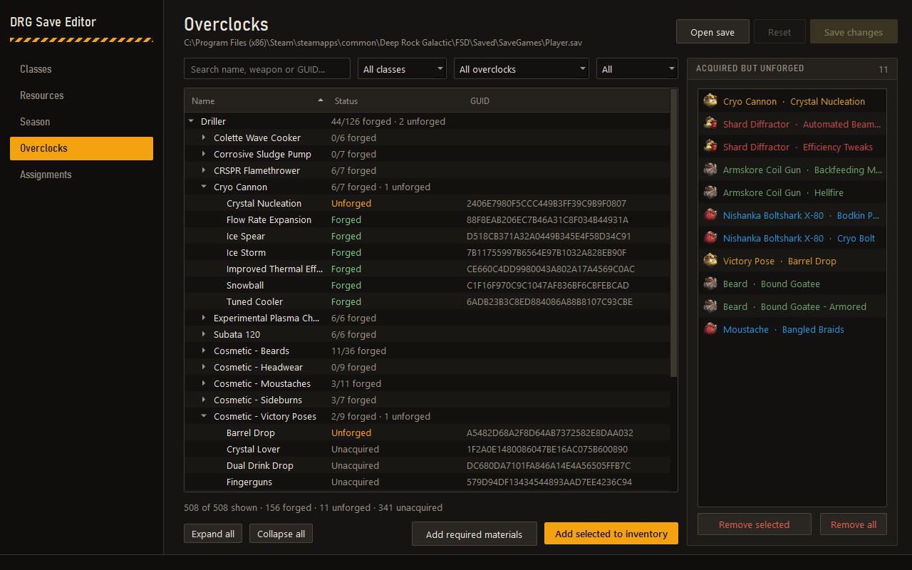
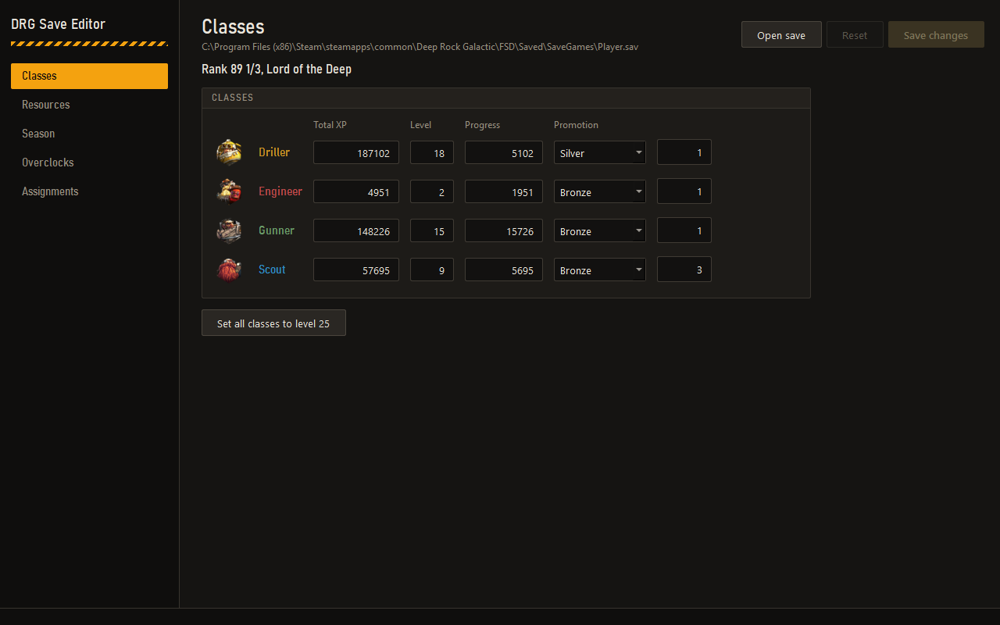

# Deep Rock Galactic Save Editor

Continuation of the DRG Save Editor first created here: https://github.com/robertnunn/DRG-Save-Editor

I decided to pick up on implementing some of the features here after being personally grievanced by some of the assignments locking you into them until you complete them, preventing me from picking up the holiday assignments to play with my friends.

Standalone DRG save editor written in python, using PySide6 and packaged with PyInstaller. Release builds are made by GitHub Actions when a `v*` tag is pushed.

## Requirements
- Windows 10 or later (the Qt 6 / modern Python builds don't support Windows 7)

## Installation
Download the latest zip from the Releases page, extract it, and run `DRG Save Editor.exe`.

## Running from source
```
pip install -r requirements.txt
python src/main/python/main.py
```
Run it from the repository root, since `guids.json`, `cosmetics.json` and `campaigns.json` are read from the working directory.

## Known Issues
- The editor still finds most values (resources, XP, credits, perk points, promotions) by searching the raw save data. If something isn't in the save yet (e.g. a resource you've never owned) the editor can give nonsensical results. The solution is to acquire at least one of the resource in game _then_ use the editor.

## Troubleshooting
If the editor fails to start, please run it from source (see Running from source) in a command prompt. This will let you see any error messages that will be necessary for bug fixes. 

If the editor opens but doesn't edit your save properly (i.e., values not being read properly, changes not being reflected in-game, etc) please open an issue, describe the problem as thoroughly as you can, and attach a copy of your save file from BEFORE any edits were attempted.

## Usage
### ALWAYS BACKUP YOUR SAVE FILE!
The editor will make a backup of the save file you open in the same folder as the save file with the extension of `.old`. The editor makes this backup at the moment you open the save file.

The editor is split into pages, picked in the sidebar: Classes, Resources, Season, Overclocks and Assignments. Open a save, change what you want, and press **Save changes** (Ctrl+S).

### Overclocks Tab


### Classes Tab


## Data sources
Overclock names, costs and GUIDs in `guids.json` were verified against the game's own data (extracted with FModel).
